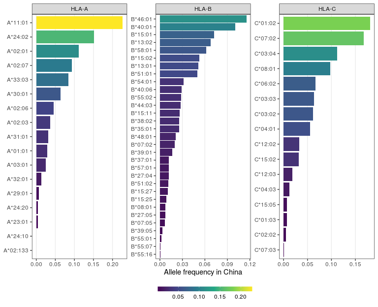

Alelos HLA em câncer de bexiga
================

``` r
library(tidyverse)
library(rvest)
```

## Alelos dos pacientes

``` r
# ler com read.table ao invés de read_tsv
# porque o arquivo tem inconsistências com o separador nas últimas linhas
# espaços em número variável ao invés de tabs
hlatypes <- read.table("./hlatypes.txt", header = TRUE) %>%
    as_tibble() %>%
    pivot_longer(-1, names_to = "locus", values_to = "allele") %>%
    mutate(locus = sub("^(HLA)\\.([ABC])_\\d$", "\\1-\\2", locus),
           allele = toupper(allele),
           allele = sub("^HLA_([^_]+)_(\\d+)_(\\d+)$", "\\1*\\2:\\3", allele),
           allele = recode(allele, "A*07:07" = "A*02:07")) #fix typo

hlatypes
```

    # A tibble: 234 x 3
       Patient            locus allele 
       <chr>              <chr> <chr>  
     1 SRR650130_B100.sra HLA-A A*31:01
     2 SRR650130_B100.sra HLA-A A*24:02
     3 SRR650130_B100.sra HLA-B B*07:02
     4 SRR650130_B100.sra HLA-B B*15:25
     5 SRR650130_B100.sra HLA-C C*07:02
     6 SRR650130_B100.sra HLA-C C*03:04
     7 SRR650131_B101.sra HLA-A A*02:03
     8 SRR650131_B101.sra HLA-A A*11:01
     9 SRR650131_B101.sra HLA-B B*58:01
    10 SRR650131_B101.sra HLA-B B*40:01
    # … with 224 more rows

## Busca dos alelos nos bancos do NetMHC e NetMHCpan

Vamos comparar os alelos dos pacientes com aqueles presentes nos bancos
do NetMHC e NetMHCpan:

``` r
netmhc <- 
    "https://services.healthtech.dtu.dk/services/NetMHC-4.0/MHC_allele_names.txt" %>%
    read_tsv(col_names = FALSE) %>%
    setNames(c("id", "allele", "locus")) %>%
    select(locus, allele) %>%
    mutate(allele = sub("^HLA-", "", allele))

netmhcpan <- 
    "https://services.healthtech.dtu.dk/services/NetMHCpan-4.1/MHC_allele_names.txt" %>%
    read_tsv(col_names = FALSE) %>%
    setNames("allele") %>%
    mutate(allele = sub("^HLA-([A-Z]+)(.+)$", "\\1*\\2", allele))
   
hlatypes %>%
    drop_na() %>%
    mutate(NetMHC = allele %in% netmhc$allele,
           NetMHCpan = allele %in% netmhcpan$allele) %>%
    summarise_at(vars(4:5), mean) %>%
    pivot_longer(1:2, names_to = "database", values_to = "percent") %>%
    mutate(percent = scales::percent(percent)) %>%
    knitr::kable()
```

| database  | percent |
| :-------- | :------ |
| NetMHC    | 65%     |
| NetMHCpan | 100%    |

Vemos que 65% dos alelos são encontrados no NetMHC, mas todos os alelos
são encontrados no NetMHCpan v4.1.

## Busca no allelefrequencies.net para obter a frequência alélica

Vamos buscar esses alelos no Allelefrequencies.net para ver sua
frequência na população chinesa.

Para isso criei a função abaixo:

``` r
get_frequency <- function(allele) {
    
    hlaurl <- 
        "http://www.allelefrequencies.net/hla6006a.asp?hla_selection=%s&hla_country=China"

    hlahtml <- hlaurl %>%
        sprintf(sub("HLA-", "", allele)) %>%
        read_html()

    nodes <- html_nodes(hlahtml, "table")

    if (grepl("Sorry, we did not find any results", nodes[[4]]))
    return(NA)

    nodes[[5]] %>%
        html_table(fill = TRUE, header = TRUE) %>%
        select(2, 4, 6, 8) %>%
        as_tibble() %>%
        setNames(c("allele_db", "population", "f", "sample_size")) %>%
        mutate(sample_size = as.integer(sub(",", "", sample_size)))
}
```

Ela tem o seguinte output quando aplicada a um alelo:

``` r
get_frequency("A*01:01")
```

    # A tibble: 19 x 4
       allele_db population                                   f sample_size
       <chr>     <chr>                                    <dbl>       <int>
     1 A*01:01   China Beijing                           0.037           67
     2 A*01:01   China Beijing Shijiazhuang Tianjian Han 0.034          618
     3 A*01:01   China Canton Han                        0.006          264
     4 A*01:01   China Guangzhou                         0.01           102
     5 A*01:01   China Guizhou Province Bouyei           0.005          109
     6 A*01:01   China Guizhou Province Miao pop 2       0               85
     7 A*01:01   China Guizhou Province Shui             0              153
     8 A*01:01   China Hubei Han                         0.0229        3732
     9 A*01:01   China Inner Mongolia Region             0.054          102
    10 A*01:01   China Jiangsu Han                       0.037         3238
    11 A*01:01   China Jiangsu Province Han              0.0174         334
    12 A*01:01   China North Han                         0              105
    13 A*01:01   China Qinghai Province Hui              0.055          110
    14 A*01:01   China Shanxi HIV negative               0.091           22
    15 A*01:01   China Sichuan HIV negative              0.059           34
    16 A*01:01   China South Han                         0.005          284
    17 A*01:01   China Uyghur HIV negative               0.026           19
    18 A*01:01   China Yunnan Province Han               0.015          101
    19 A*01:01   Germany DKMS - China minority           0.038         1282

Vamos aplicar a todos os alelos dos pacientes. Como são várias
amostragens na China, vou tirar uma média ponderada da frequência
alélica dados os tamanhos amostrais.

Aplicar a todos os alelos pode levar alguns minutos, então vou
paralelizar com `furrr`.

``` r
library(furrr)

plan(multisession, workers = 8)

allele_freqs <- hlatypes %>% 
    drop_na() %>%
    distinct(locus, allele) %>%
    mutate(data = future_map(allele, get_frequency)) %>%
    unnest(data) %>%
    group_by(locus, allele) %>%
    summarise(wf = weighted.mean(f, sample_size)) %>%
    ungroup()

allele_freqs
```

    # A tibble: 64 x 3
       locus allele         wf
       <chr> <chr>       <dbl>
     1 HLA-A A*01:01   0.0284 
     2 HLA-A A*02:01   0.112  
     3 HLA-A A*02:03   0.0367 
     4 HLA-A A*02:06   0.0455 
     5 HLA-A A*02:07   0.0936 
     6 HLA-A A*02:133 NA      
     7 HLA-A A*03:01   0.0243 
     8 HLA-A A*11:01   0.227  
     9 HLA-A A*23:01   0.00402
    10 HLA-A A*24:02   0.152  
    # … with 54 more rows

Verificamos quais alelos não estão no banco do allelefrequencies.net:

``` r
allele_freqs %>% 
    filter(is.na(wf)) %>%
    pull(allele)
```

    [1] "A*02:133"

Para esse alelo, ainda podemos buscar no banco de alelos raros.

Para isso, vou precisar criar uma função similar à anterior:

``` r
get_rare <- function(allele) {

    hlaurl <- "http://www.allelefrequencies.net/hla6002a.asp?all_name=%s"

    hlahtml <- hlaurl %>%
    sprintf(sub("HLA-", "", allele)) %>%
    read_html()

    nodes <- html_nodes(hlahtml, "table")

    nodes[[4]] %>%
    html_table(fill = TRUE, header = TRUE) %>%
    select(2, 4, 6) %>%
    as_tibble() %>%
    setNames(c("population", "f", "sample_size"))
}
```

Aplico essa função aos alelos:

``` r
get_rare("A*02:133") %>%
    filter(f > 0) %>%
    knitr::kable(format.args = list(scientific = FALSE))
```

| population                      |      f | sample\_size |
| :------------------------------ | -----: | -----------: |
| Germany DKMS - Austria minority | 0.0003 |         1698 |

Vemos que o `A*02:133` não foi descrito na China (nesse banco de dados),
apenas possui uma frequência muita baixa numa outra população.

No entanto, para os outros alelos, podemos plotar a frequência:

``` r
ggplot(allele_freqs, aes(x = reorder(allele, wf), y = wf)) +
    geom_col() +
    facet_wrap(~locus, scales = "free", ncol = 1) +
    theme(axis.text.x = element_text(angle = 90)) +
    labs(x = NULL, y = "Allele frequency in China")
```

<!-- -->
